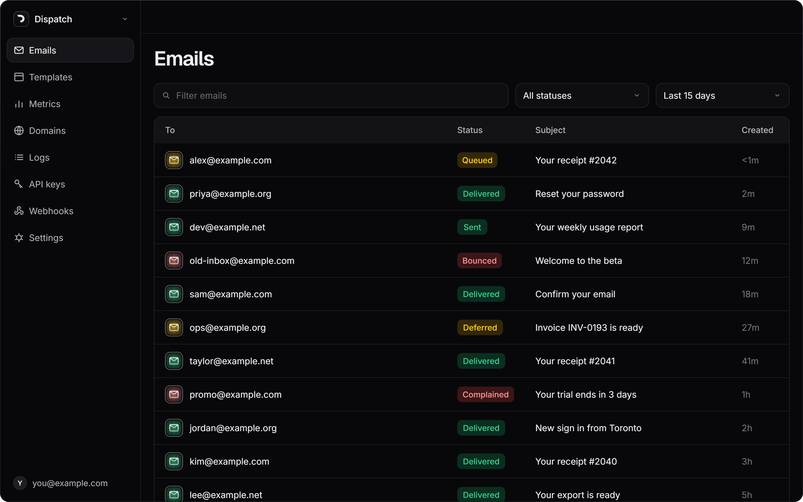
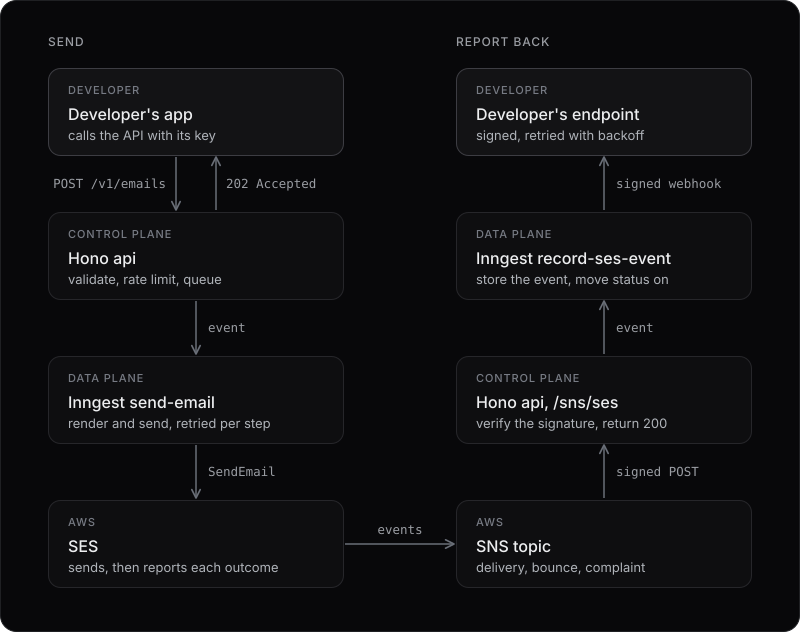
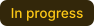

<div align="center">
  
  <h1>Dispatch</h1>
  <p>Email API for developers. One POST to send, delivery events on your webhook.</p>
  <p>
    <a href="https://dispatchit.ca">Website</a>
    &nbsp;·&nbsp;
    <a href="#how-it-works">How it works</a>
    &nbsp;·&nbsp;
    <a href="#stack">Stack</a>
    &nbsp;·&nbsp;
    <a href="#running-it-locally">Run it locally</a>
  </p>
</div>

Dispatch is an email API for developers: you verify a domain, create a key, and send with one HTTP request, and delivery, bounces and complaints come back to you as signed webhooks. It is a working product, not a mockup, sending real mail through AWS SES, built as a passion project.



The second image is the proof that the pipeline is real: a send through the deployed API to Amazon's bounce simulator, the bounce coming back from SES over SNS, and Dispatch delivering it as a signed `email.bounced` webhook.

## How it works

The API that accepts a send never sends anything. It is split into a **control plane**, which answers the caller, and a **data plane**, which does the slow and unreliable work afterwards.

<p align="center">
  
</p>

Why it is built this way:

- **The caller's latency never depends on SES.** `POST /v1/emails` validates, rate limits per key, writes a `queued` row and returns `202`. The send happens in an Inngest function with retries, so an SES hiccup is a retry, not a failed request.
- **Every step can run twice safely.** Inngest retries steps and SNS redelivers on any doubt, so each write is idempotent: events carry dedup ids, a send checks the row is still `queued` before sending, and a redelivered notification finds its own id already stored.
- **Status never moves backwards.** SES reports out of order, and a bounce can arrive before the send step has finished recording that it sent. Every status write is conditional on a rank (`queued` < `sent` < `delivery_delayed` < `delivered` < `bounced`/`complained`), checked in the same SQL statement that writes it.
- **The transport is an interface.** `ConsoleTransport` in tests and local development, `SesTransport` in production, so the pipeline and its tests never touch AWS.

## Stack

<div align="center">

| Layer | Choice | Why |
|---|---|---|
| API | Hono | Small, typed, and runs unchanged as a Vercel function |
| Web | Next.js 15, App Router | Server components read the database directly, so there is no client fetching library |
| Styling | Tailwind, Radix Primitives, Radix Colors | A dark-first token set in `design/design-system`, and accessible primitives underneath |
| Validation | Zod | Schemas are the source of truth for types, via `z.infer` |
| Database | Postgres + Drizzle | SQL that reads as SQL, including the conditional status updates |
| Auth | Supabase | |
| Rate limiting | Upstash Redis | A sliding window per API key, so one noisy integration cannot starve the others |
| Jobs | Inngest | Durable steps with retries, and step-level idempotency, for the whole data plane |
| Email | AWS SES, behind a `Transport` interface | Real DKIM, real bounces and a real event stream, which is what makes Domains, Metrics and Webhooks honest |
| Webhooks | Hand-rolled, [Standard Webhooks](https://www.standardwebhooks.com/) signing | Signatures match the Standard Webhooks reference implementation byte for byte, the scheme Svix and Resend use, with no vendor in the path |
| Flags | PostHog | Large features merge to `main` in small PRs, dark until finished |
| Infrastructure | Terraform | The SES configuration set and SNS topic, in `infra/` |
| Hosting | Vercel, two projects | `dispatch` for the web app, `dispatch-api` for the api as one serverless function |
| Lint and format | Biome | |
| Logging | Winston | |
| Tests | Vitest, Playwright | Unit tests for the pipeline and signing, and an end-to-end suite against every preview deploy |

</div>

## Running it locally

You need Node 22 (pinned in `.nvmrc`), pnpm, and a Postgres database. A Supabase project provides both the database and auth.

1. Copy `apps/web/.env.example` to `apps/web/.env.local` and `apps/api/.env.example` to `apps/api/.env.local`, and fill them in. Each variable is commented with what breaks without it. For a first run you can leave `EMAIL_TRANSPORT=console`, which logs a send instead of making one, and skip SES entirely.
2. Install and migrate:
   ```sh
   pnpm install
   pnpm --filter @dispatch/db db:migrate
   ```
3. Run the web app (port 3000), the api (port 3001) and the Inngest dev server, which discovers the api's functions:
   ```sh
   pnpm dev
   npx inngest-cli@latest dev -u http://localhost:3001/api/inngest
   ```

<div align="center">

| Command | What it does |
|---|---|
| `pnpm dev` | Run the web app and the api |
| `pnpm build` | Build everything |
| `pnpm lint` / `pnpm format` | Biome, checking or fixing |
| `pnpm typecheck` | `tsc --noEmit` across the repo |
| `pnpm test` | Unit tests |
| `pnpm e2e` | The Playwright suite, against `localhost:3000` by default |

</div>

CI runs lint, typecheck, unit tests and a build on every pull request. The Playwright suite runs separately against each web preview deploy, so a slow browser suite never holds up the fast checks.

## What is deliberately not built

- **The dashboard is desktop-only.** The landing page and the auth pages work on a phone, because that is where a shared link lands. The dashboard does not: a 252px sidebar and six-column tables need horizontal room, and the alternatives are a second dashboard to maintain for an audience that is at a desk. Narrow screens get a notice saying so.
- **There is no search.** An early placeholder search box searched nothing and was removed. Every list holds one account's data, and search across emails, domains and templates is a feature with its own indexing questions, not a box in the top bar.
- **Lists do not poll.** Every table is a plain server read, refreshed by loading the page. The one poller watches a domain you are waiting on to verify, and stops when it settles.
- **The end-to-end suite covers the UI paths only.** It proves the landing page, login, API keys, templates and the 404 page work on a real deploy. The send pipeline is verified by hand instead, because previews share production's Inngest keys, so a send from a preview would run production's functions rather than the change under test.
- **Previews share one Supabase project with production.** Every end-to-end run works inside its own throwaway account and deletes it afterwards. CI never runs migrations, so a pull request that adds one fails its end-to-end run until it is merged and migrated by hand.
- **Auth email still goes through Resend.** Supabase's default SMTP is rate-limited and not for production, so Resend carried sign-up and password reset mail from the start. Moving it onto Dispatch's own SES pipeline is the one swap still owed.

## How it was built

Sixteen phases, each shipped as a series of small pull requests merged to `main`. This table records what each one delivered.

<div align="center">

| Phase | What | Status |
|---|---|---|
| `00` | IDE, Repo, Turborepo, Biome, TS strict, CLAUDE.md, PR template, CI |  |
| `01` | Design system in Claude Design, tokens, logo |  |
| `02` | Landing page: header, hero, footer |  |
| `03` | Supabase auth, signup and login pages, session middleware |  |
| `04` | Dashboard shell: sidebar, routing, empty states |  |
| `05` | API keys: generation, hashing, one-time reveal, Hono skeleton |  |
| `06` | Domains: SES identity, DKIM records, on-demand verification check |  |
| `07` | Send pipeline + Emails list and detail, domain verification polling, rate limiting |  |
| `08` | Templates: CRUD, variable interpolation, live preview |  |
| `09` | Compatibility checker, shipped behind a PostHog flag |  |
| `10` | Webhooks: signing, retries, delivery log, SNS bounce ingestion |  |
| `11` | Metrics and Logs |  |
| `12` | Settings and Profile |  |
| `13` | Deployment: both apps live, env verified, SNS on a permanent endpoint |  |
| `14` | Polish, Playwright E2E, request log retention, README |  |
| `15` | UI Polish: Landing page, Auth Pages, Dashboard, three.js mp4 |  |

</div>

Engineering rules live in [CLAUDE.md](CLAUDE.md), design rules in [design/design-system/CLAUDE.md](design/design-system/CLAUDE.md).

```
apps/
  web/        Next.js: landing, auth, dashboard
  api/        Hono: the public REST api, v1
packages/
  db/         Drizzle schema, migrations, queries
  core/       send pipeline, key hashing, webhook signing, SNS verification
  compat/     email client compatibility checker, framework-free
  ui/         Radix + Tailwind components
  e2e/        Playwright suite, run against preview deploys
  config/     currently unused
design/       the design system: tokens, foundations, logo
infra/        Terraform for the SES configuration set and SNS topic
```
